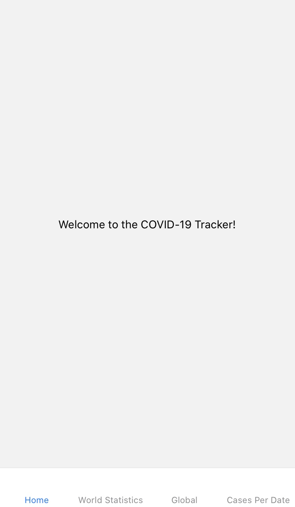

# HW7: Use CODVID-19 API (Documentation using postman) to build mobile application

## Schedule:
* April 8th: Set up your React Native environment
* April 10th: Go through REACT native tutorial, build Hello Applications, run Hello applications on emulator and phone, then run it on two phones 
* April 12th: Develop use case to display map
* April 17th: On separate branch, exercise CODVID-19 API and display the data in your application as text. Be fancy and style your results
* April 24th: Overlay the data on the maps

## Overall Goals:
* It will show CODVID cases per country on a MAP
* It will show CODVID cases per country Live on a MAP
* It will show CODVID cases per country based on a date.
* It will show a summary of total cases for the world
* It will show a summary for the World

## Potential Further Implementations:
* Display data per Province
* User can put their address and track CODVID-19 in their neighborhood (Only in countries where regional data is provided)

# Layout and Functionality:

## Home
This is the homepage that will welcome the user to this application, from here they would click to see world statistics, world map, or check the cases per date.

## World Statistics
This is the page that will show the world statistics of corona virus, with number of total cases, deaths, and recoveries.

## World Map
Here is the page where users can see the data per country. The application will ask for the user to provide it's location and will show a marker on the map there. To find out stats about your local country click on the marker to display the information. If you want to get the stats for a new country you have to long press (press for approx. 3 seconds) to place the marker somewhere else and get the information for that country by clicking on the new marker.

  
  
  

## Cases By Date
The API call wasn't working properly at https://api.covid19api.com/live/country/south-africa/status/confirmed/date/2020-03-21T13:13:30Z so this page isn't fully functional.
